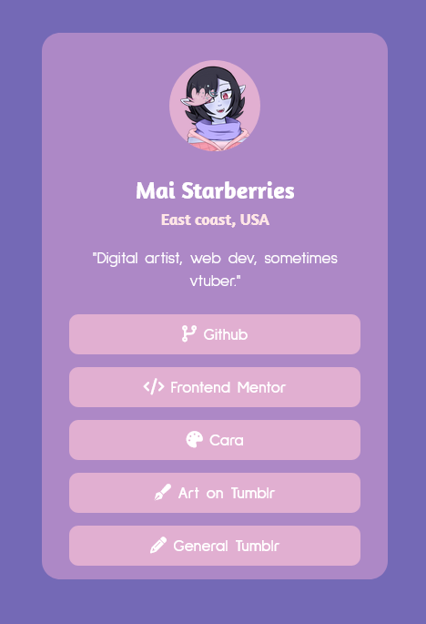

# Frontend Mentor - Social links profile solution

This is a solution to the [Social links profile challenge on Frontend Mentor](https://www.frontendmentor.io/challenges/social-links-profile-UG32l9m6dQ). Frontend Mentor challenges help you improve your coding skills by building realistic projects. 

## Table of contents

- [Overview](#overview)
  - [The challenge](#the-challenge)
  - [Screenshot](#screenshot)
  - [Links](#links)
- [My process](#my-process)
  - [Built with](#built-with)
  - [What I learned](#what-i-learned)
  - [Continued development](#continued-development)
  - [Useful resources](#useful-resources)
- [Author](#author)

## Overview

### The challenge

Users should be able to:

- See hover and focus states for all interactive elements on the page

### Screenshot



### Links

- [Solution URL](https://github.com/starberries/social-links-profile.git)
- [Live Site URL](https://starberries.github.io/social-links-profile/)

## My process

### Built with

- Semantic HTML5 markup
- CSS custom properties
- Flexbox
- Mobile-first workflow

### What I learned
Aside from this project making for a good opportunity for more practice with responsive design and measurement units, it also served as a chance to learn more about styling things like button-style anchor elements. This was a little tricky, since my original solution was to make the background color a property of the parent list item, put the anchor element inside, and have both change color appropriately when hovered. *However*, this caused a problem, as while the whole faux-button did respond to hover, you can only follow the link by clicking directly on the anchor text itself, which is unintuitive. A hacky soluton would be to make the anchor the parent of the list item, but this isn't good practice.

Going back to putting the background color on the anchor itself, some quick research reminded me I could just use padding to center the anchor text within the faux-button, which is nice and simple, but I wanted to see if I could make it scalable. Hard-coding a specific number wouldn't keep the text centered if the height of the buttons was changed. So, I ended up with the following:

```
:root {
    --button-height: 2.2rem;
}

.socials-main ul li a {
    height: var(--button-height);
    padding: calc(((var(--button-height) - 1em) / 2) - 0.125rem) 0;
}
```

The `- 0.125rem` is still a bit of hard-coding to do a small adjustment to the texting placment on account of its font alongisde the icons I added, but it gets the job well enough for my purposes I think. 

### Continued development

This was fun! I had a lot of ideas for little flourishes I considered added to the look of the page, like using box-shadow to add a glow effect to elements when hovered as well, and while I ultimately decided to stick more or less to the design preview save for color and font choice for simplicity at the moment, playing around with more fun ways of styling things is something I'd like to do a bit more in the future.

### Useful resources

- [Font Awesome](https://fontawesome.com/) for icons
- [CDNJS](https://cdnjs.com/libraries/font-awesome) for quick setup of Font Awesome icons
- [ColorHunt](https://colorhunt.co) - Colors!
- [CSS Tricks](https://css-tricks.com/css-basics-styling-links-like-boss/) proved helpful in figuring out how to style a button-like anchor

## Author

- GitHub - [starberries](https://github.com/starberries)
- Frontend Mentor - [@starberries](https://www.frontendmentor.io/profile/starberries)
